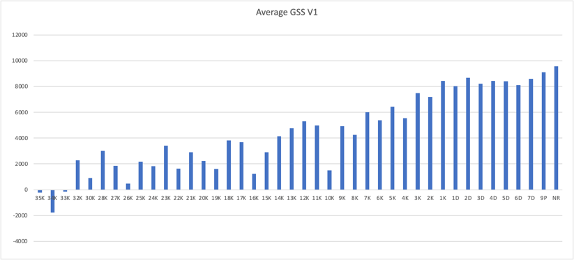

# go-strength-analyser

To provide an absolute measurement of go strength, compare
to [Elo Rating System](https://en.wikipedia.org/wiki/Elo_rating_system.)
, which is a relative measurement on the skill level

## How

Use AI(currently katago) to analyse the game, based on the metrics(winrate, scoreLead), we calculate the Go Strength
Score(GSS)
by defined formula.

### Formula (V1)

Basic idea is to measure where the move is located between best move and worst move on the board. Assuming:

- best move = best move from AI
- worst move = pass

### Move Score

For a $metric$, we use values candidate move: $metric_{candidate}$, ai move: $metric_{ai}$ and pass move: $metric_{pass}$.
The formula of metric $score_m$ is:   
$$ moveScore_{metric} = {2metric_{candidate} - metric_{pass} - metric_{ai} \over metric_{ai} - metric_{pass}} $$

Which is a linear model. i.e. If the move is best(ai), the score will be 1. If the move is worst(pass), the score will be -1. If
the move is in middle of best and worst, the score will be 0.

2 metrics are used to calculate the score _winrate_ and _scorelead_.
So we have 2 scores for each move, winrate score and score lead score.

### Game Score

Black player and White player will have their own Game Score, using their move scores

$$ gameScore_{metric} = {\sum(moveScore_{metric} * weight) / \sum(weight)}$$

where $weight = metric_{ai} - metric_{pass}$

The final Go Strength Score($GSS$) is calculated by

$$ GSS = avg(gameScore_{winrate}, gameScore_{scoreLead}) * 10000 $$

### Result
Games and analyse info are coming from [go-strength-analyse-sgf](https://github.com/samabcde/go-strength-analyse-sgf)



| Rank | Avg      | Min      | Max      | Std     | Count |
|------|----------|----------|----------|---------|-------|
| 35K  | -222.76  | -685.60  | 240.07   | 462.84  | 2     |
| 34K  | -1768.72 | -1768.72 | -1768.72 | 0.00    | 1     |
| 33K  | -147.44  | -147.44  | -147.44  | 0.00    | 1     |
| 32K  | 2289.61  | -389.43  | 4796.66  | 2439.26 | 4     |
| 30K  | 910.84   | 910.84   | 910.84   | 0.00    | 1     |
| 28K  | 3018.93  | 922.71   | 5403.80  | 1608.87 | 4     |
| 27K  | 1851.07  | 723.67   | 3028.85  | 941.76  | 3     |
| 26K  | 485.08   | 485.08   | 485.08   | 0.00    | 1     |
| 25K  | 2178.92  | 880.55   | 3477.28  | 1298.37 | 2     |
| 24K  | 1817.76  | -1245.62 | 6545.68  | 2593.77 | 5     |
| 23K  | 3415.34  | 1346.74  | 5748.25  | 1806.60 | 3     |
| 22K  | 1623.86  | 452.63   | 3159.14  | 1063.01 | 5     |
| 21K  | 2912.54  | 888.68   | 6385.57  | 1747.96 | 10    |
| 20K  | 2233.39  | -2337.32 | 5649.41  | 2344.54 | 10    |
| 19K  | 1619.02  | -519.40  | 3957.81  | 1594.63 | 4     |
| 18K  | 3830.90  | 1842.72  | 5775.39  | 1158.22 | 11    |
| 17K  | 3686.36  | 138.62   | 6087.89  | 2080.74 | 7     |
| 16K  | 1231.58  | 842.87   | 1620.29  | 388.71  | 2     |
| 15K  | 2889.84  | 2163.86  | 4262.80  | 971.36  | 3     |
| 14K  | 4155.51  | 2377.76  | 6173.55  | 1355.16 | 8     |
| 13K  | 4765.49  | 3853.19  | 5677.79  | 912.30  | 2     |
| 12K  | 5302.70  | 3471.15  | 8292.55  | 1618.29 | 6     |
| 11K  | 4967.74  | 4499.09  | 5650.55  | 493.87  | 3     |
| 10K  | 1489.56  | -2872.43 | 4043.10  | 3099.36 | 3     |
| 9K   | 4914.95  | 3969.89  | 6080.05  | 708.04  | 5     |
| 8K   | 4242.20  | 618.76   | 6929.53  | 1978.05 | 8     |
| 7K   | 6012.87  | 5335.27  | 6690.46  | 677.60  | 2     |
| 6K   | 5377.91  | 3968.77  | 6660.28  | 1129.03 | 5     |
| 5K   | 6431.94  | 3518.18  | 7468.91  | 1398.73 | 6     |
| 4K   | 5541.65  | 3369.30  | 7478.32  | 1223.56 | 10    |
| 3K   | 7491.49  | 7023.35  | 7959.63  | 468.14  | 2     |
| 2K   | 7183.73  | 7183.73  | 7183.73  | 0.00    | 1     |
| 1K   | 8422.96  | 8422.96  | 8422.96  | 0.00    | 1     |
| 1D   | 8032.66  | 7771.48  | 8293.83  | 261.17  | 2     |
| 2D   | 8685.02  | 7408.05  | 9584.86  | 733.95  | 16    |
| 3D   | 8217.64  | 6963.10  | 9072.75  | 651.69  | 7     |
| 4D   | 8435.07  | 6113.26  | 9704.07  | 1050.05 | 11    |
| 5D   | 8393.82  | 7556.60  | 9601.42  | 708.03  | 10    |
| 6D   | 8112.16  | 4883.12  | 9475.95  | 1417.85 | 9     |
| 7D   | 8594.31  | 7730.12  | 9832.28  | 885.41  | 4     |
| 9P   | 9102.16  | 8187.41  | 9757.60  | 403.39  | 19    |
| NR   | 9578.71  | 9578.71  | 9578.71  | 0.00    | 1     |

## Development

### Prerequisite
1. jdk 16 or higher
2. [KataGo](https://github.com/lightvector/KataGo) is installed
3. set properties in project folder `config/application-dev.properties`

### Build
In project folder, run 
```shell
./gradlew build
```

### Analyse sgf
In project folder, run 
```shell
./gradlew bootRun --args='kata_go -sgfName="{name of your sgf}" -runTimeSec={time you want to run} --spring.profiles.active=dev'
```
